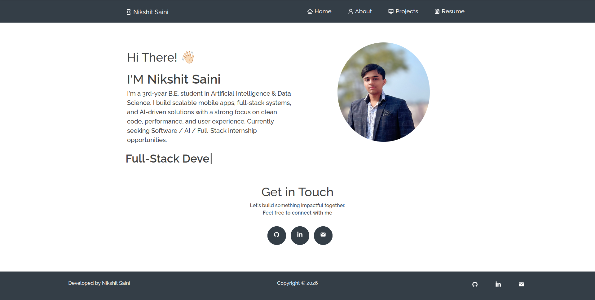

<h1 align="center">
  🚀 Nikshit Saini - Portfolio
</h1>

<p align="center">
  <a href="https://NikshitPortfolio.netlify.app/" target="_blank">
    
  </a>
  <a href="https://github.com/NikshitSaini/NikshitPortfolio" target="_blank">
    
  </a>
</p>

<div align="center">
  
</div>

<p align="center">
  A modern, responsive portfolio website showcasing my journey as an AI & Full-Stack Developer
</p>

---

## 👨‍💻 About Me

I'm **Nikshit Saini**, a 3rd-year B.E. student in Artificial Intelligence & Data Science at D.Y. Patil College of Engineering, Pune. I build scalable mobile apps, full-stack systems, and AI-driven solutions with a strong focus on clean code, performance, and user experience.

**Currently seeking Software / AI / Full-Stack internship opportunities.**

---

## ✨ Features

- 📱 **Fully Responsive** - Works seamlessly on desktop, tablet, and mobile
- 🎨 **Modern UI/UX** - Dark theme with smooth animations and transitions
- 🧩 **Multi-Page Layout** - Home, About, Projects, and Resume sections
- 🚀 **Project Showcase** - Interactive project cards with GitHub links
- 🏆 **Achievements Section** - LeetCode stats and certifications
- 🎓 **Education Details** - Academic qualifications and CGPA
- 📝 **Resume Download** - Downloadable PDF resume
- ⚡ **Fast Performance** - Optimized React.js application

---

## 🛠️ Built With

This portfolio was built using modern web technologies:

- **React.js** - Frontend framework
- **React Router** - Navigation
- **React Bootstrap** - UI components
- **CSS3** - Custom styling and animations
- **React PDF** - Resume viewer
- **Typewriter Effect** - Dynamic text animations
- **React Icons** - Icon library

---

## 🚀 Projects Featured

### 1. Employee Shift Scheduler

Full-stack web app with JWT authentication, role-based access control, and shift management.

**Tech Stack:** Vite, React, Express, MongoDB, JWT, Vercel

### 2. BookScout

Full-stack mobile app for book reviews with authentication, community feeds, and image uploads.

**Tech Stack:** React Native, Expo, Node.js, Express, MongoDB, Zustand, Cloudinary

### 3. Bookify

Multi-platform book browsing app with Backend-as-a-Service integration.

**Tech Stack:** React Native, Appwrite, Expo Router, Zustand

### 4. Daily Question Counter

AI-powered LeetCode progress tracker with streak monitoring.

**Tech Stack:** JavaScript, AI integration

---

## 🏆 Achievements

- 🧠 Solved **300+ DSA problems** on LeetCode
- 🔥 **50-Day ×2 & 100-Day streak badges**
- 🏅 **DCC March 2025 badge**
- � **NVIDIA Fundamentals of Deep Learning** (2025)
- 📜 **Agentic AI for Everyone** (2025)

---

## 🎓 Education

**B.E. Artificial Intelligence & Data Science**  
D.Y. Patil College of Engineering, Pune  
📊 CGPA: **8.69** (2023 – Present)

**Class XII – Science Stream**  
CBSE Board (2022)

---

## 🛠️ Installation and Setup

### Prerequisites

- Node.js (v14 or higher)
- npm or yarn

### Local Development

1. **Clone the repository**

   ```bash
   git clone https://github.com/NikshitSaini/NikshitPortfolio.git
   cd NikshitPortfolio
   ```

2. **Install dependencies**

   ```bash
   npm install
   ```

3. **Start the development server**

   ```bash
   npm start
   ```

4. **Open in browser**
   ```
   http://localhost:3000
   ```

The app will automatically reload when you make changes.

### Build for Production

```bash
npm run build
```

This creates an optimized production build in the `build` folder.

---

## 📂 Project Structure

```
react-portfolio/
├── public/
│   ├── index.html
│   └── manifest.json
├── src/
│   ├── Assets/
│   │   ├── Projects/          # Project screenshots
│   │   └── Nikshit-Resume.pdf # Resume PDF
│   ├── components/
│   │   ├── About/             # About section components
│   │   ├── Home/              # Home page components
│   │   ├── Projects/          # Projects section
│   │   └── Resume/            # Resume viewer
│   ├── Constants.js           # Project data and constants
│   ├── App.js                 # Main app component
│   └── style.css              # Global styles
├── package.json
└── README.md
```

---

## 🎨 Customization

### Update Personal Information

Edit `/src/Constants.js` to customize:

- **Projects** - Add/modify your projects
- **Skills** - Update your tech stack
- **Achievements** - Add certifications and milestones
- **Education** - Update academic details

### Update Social Links

Edit `/src/components/SocialMedia.js` to add your:

- GitHub profile
- LinkedIn profile
- Email address

### Replace Assets

- **Profile Photo:** Replace `/src/Assets/Nikshit.jpg`
- **Resume PDF:** Replace `/src/Assets/Nikshit-Resume.pdf`
- **Project Screenshots:** Add images to `/src/Assets/Projects/`

---

## 🚀 Deployment

### Deploy to Netlify

1. Build the project: `npm run build`
2. Drag and drop the `build` folder to [Netlify](https://app.netlify.com)

**Or use Netlify CLI:**

```bash
npm install -g netlify-cli
netlify deploy --prod
```

### Deploy to Vercel

```bash
npm install -g vercel
vercel --prod
```

---

## 📧 Contact

**Nikshit Saini**

- 📧 Email: nikshithansi@gmail.com
- 📱 Phone: +91 9817255915
- 💼 GitHub: [github.com/NikshitSaini](https://github.com/NikshitSaini)
- 🌐 Portfolio: [NikshitPortfolio.netlify.app](https://NikshitPortfolio.netlify.app/)

---

## 📄 License

This project is open source and available under the [MIT License](LICENSE).

---

## 🙏 Acknowledgments

- Original template inspiration: [sunilyadav8/sunil-portfolio](https://github.com/sunilyadav8/sunil-portfolio)
- Icons: [React Icons](https://react-icons.github.io/react-icons/)
- UI Components: [React Bootstrap](https://react-bootstrap.github.io/)

---

<p align="center">
  Made with ❤️ by Nikshit Saini
</p>

<p align="center">
  <a href="#top">⬆️ Back to Top</a>
</p>
